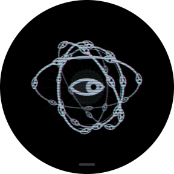
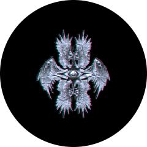

# Orbe Watch

<p align="center">

</p>

O [Orbe](https://github.com/orbe-project/orbe-desktop) num relógio Wear OS,
desenhado na GPU do relógio com os mesmos shaders do desktop. O relógio não é
um agente, é a ponte de fala: segurando o orbe, a sua voz vai para o agente no
computador (Claude Code, OpenCode, Gemini CLI, Hermes Agent ou qualquer agente
ACP), o raciocínio aparece abaixo da figura e a resposta volta em voz.

| Anel de energia | Seraphim (gravura) | Ophanim | Ophanim com asas |
|:-:|:-:|:-:|:-:|
|  |  |  |  |

Cada avatar passando por em espera, ouvindo, pensando e falando.

## Como funciona

```
   relógio (Wear OS)                       computador
┌────────────────────┐   WebSocket   ┌──────────────────────────┐
│ orbe na GPU        │◄── linhas ────│ ponte do relógio         │
│ microfone ─────────┼── PCM 16k ───►│  • daemon do Orbe (Linux)│
│ alto-falante ◄─────┼── voz ────────│  • orbe de pulso         │
│ toque ─────────────┼── touch ─────►│    (qualquer SO)         │
└────────────────────┘               └────────────┬─────────────┘
                                                  ▼
                                   fala → texto → agente → voz
```

A ponte fala o mesmo protocolo de linhas do orbe do desktop (`show`, `state`,
`level`, `line`…), então o orbe do pulso é igual ao do computador, estado por
estado. Ela é servida de dois jeitos:

- **Pelo daemon** (`hermes_voice_daemon.py`), no Linux com o desktop. A sessão
  aberta pelo relógio ouve só o microfone do relógio e toca a resposta onde o
  relógio pediu.
- **Pelo orbe de pulso** (`hermes_voice_pulso.py`), sem o desktop: Python puro,
  testado no Windows.

Os dois scripts são do [orbe-desktop](https://github.com/orbe-project/orbe-desktop),
que também é o submódulo `orbe-desktop/` deste repositório. Os comandos
`./hermes_voice_*.py` e `./claude-orbe` abaixo rodam na pasta dele.

## Requisitos

- **Relógio:** Wear OS 3 ou mais novo (API 30) com OpenGL ES 3.0 e depuração
  por Wi-Fi ligada.
- **Computador:** Python 3.11+ com `websockets` e `requests`. O orbe de pulso
  precisa de `GROQ_API_KEY` (transcrição) e `GEMINI_API_KEY` (voz) no ambiente
  ou num `.env` passado com `--env`.
- **Para compilar:** JDK 17 e o Android SDK.

## Começando

**1. Ligar a ponte.** Sem o desktop:

```sh
pip install websockets requests
./claude-orbe                                  # Claude Code com o canal do orbe
./hermes_voice_pulso.py --agente claude        # ou --comando "<agente ACP>" --pasta ~/projeto
```

Com o daemon, ligue o grupo **Relógio** na aba Ativação do app do Orbe, ou
rode `./hermes_voice_relogio.py --ligar` e reinicie o serviço. Os dois mostram
o endereço e o **token** do pareamento. A ponte abre a porta **8777** na rede
local e só conversa com quem tem o token.

**2. Instalar o app.**

```sh
git clone --recursive https://github.com/orbe-project/orbe-watch.git
cd orbe-watch
./gradlew :app:assembleRelease
adb install app/build/outputs/apk/release/app-release.apk
```

O APK de release sai assinado com a chave de debug. Para distribuir, assine
com a sua.

**3. Parear.** Pelo adb, sem digitar no pulso:

```sh
adb shell am start -n io.hermes.orbe/.MainActivity --es servidor 192.168.0.10 --es token abcd2345
```

Ou no menu do relógio, **Conexão → Servidor** e **Token**. O servidor aceita
`192.168.0.10`, `192.168.0.10:9000`, `[fd7a::1]:8777` ou `wss://orbe.exemplo.com`.
Para ver o relógio funcionando sem agente, `./hermes_voice_relogio.py --demo`.

## Usando

| Gesto | Efeito |
|---|---|
| **Segurar** (350 ms) | Fala com o agente enquanto o dedo estiver na tela. |
| **Toques curtos** | Cada número de toques tem uma ação (tabela abaixo). |
| **Arrastar para cima ou para baixo**, ou a coroa | Passa de um orbe a outro. Cada orbe tem o seu agente. |
| **Dois dedos para cima ou para baixo** | Passa pelas instâncias do orbe: as sessões do agente dele, cada uma na sua cor. |
| **Arrastar para a esquerda** | Abre o menu. |
| **Sacudir o pulso para fora e de volta** | Com a tela acesa, abre o orbe já ouvindo. |
| **Sacudir o pulso só para fora** | Com o orbe aberto, volta ao mostrador. |

| Ação | O que faz | Padrão |
|---|---|---|
| **Abrir** | Abre a sessão; aberta, interrompe a resposta e volta a ouvir. | 1 toque |
| **Live** | Liga ou desliga o modo live (conversa sem segurar). | 2 toques |
| **Encerrar** | Encerra a sessão de voz e, se o orbe a abriu, a do agente no computador. | 3 toques |
| **Histórico** | Lista as sessões passadas do agente do orbe; escolher uma a retoma. | |
| **Nada** | | 4 toques |

Com o orbe na frente, a tela não apaga sozinha; abaixar ou virar o pulso
apaga, como em qualquer app. Se você sair do orbe com o agente pensando, a
resposta traz o orbe de volta e é falada.

Sem texto na tela, o rodapé mostra o estado da ponte: `sem servidor`,
`conectando…`, `token recusado`, `muitas tentativas` ou o motivo da queda. O
app reconecta sozinho.

## O menu

Arraste a tela para a esquerda. O menu abre numa gaveta com um botão por aba;
puxar para a direita volta um nível, e o botão do relógio também.

| Aba | O que tem |
|---|---|
| **Conexão** | Servidor, token e estado da ponte. |
| **Agentes** | Os orbes, cada um com o nome do agente que controla: tocar num troca o agente dele. Depois, o tamanho do orbe em tela (60% a 130%), a ordem da lista e a aparência: glitch, linhas de TV, fundo atrás do orbe, texto do raciocínio e seguir o orbe do PC. |
| **Voz** | Microfone do relógio, voz no relógio, voz também no PC, vibrar e falar as etapas. |
| **Ativação** | A sessão (aberta ou fechada, modo live), a ação de cada número de toques e as duas sacudidas, com calibração. |

Tudo que o menu configura também fica no `config.json` do computador, em
`relogio.ajustes`, e a aba Relógio do app do Orbe edita. Vale a mudança mais
nova, de qualquer um dos lados. Ficam só no relógio o endereço, o token e o
orbe em tela.

## Agentes e sessões

Com a ponte servida pelo daemon, tocar ou segurar o orbe abre a sessão de voz
do computador, e ela é do relógio até fechar:

- **O agente é o do orbe em tela.** Cada skin tem o seu (padrão: Claude Code),
  e o computador usa o mesmo mapa para o atalho e a palavra de ativação.
- **Terminal ou segundo plano**, como a aba Agente do app diz para cada
  agente. Num terminal, o daemon abre uma janela com o agente na pasta de
  `agente.claude_pasta`; em segundo plano, os agentes ACP rodam sem janela e o
  Claude abre com `claude --bg`. As ferramentas são aprovadas sozinhas.
- **O orbe do computador abre junto**, com os olhos em vermelho. Com
  **Seguir o relógio** ligado (aba Relógio do app), ele veste a skin e a cor
  do orbe em tela no relógio.

Na primeira vez, o Claude pede na janela a confirmação do modo sem permissões;
o daemon espera até 60 s.

### Sessões do Claude Code

Toda sessão do Claude Code aberta no computador, inclusive as abertas à mão,
vira uma instância dos orbes do Claude. Dois dedos passam de uma a outra.

- **Vagas.** A ponte lê `~/.claude/sessions` a cada 2 s. A sessão aberta pelo
  relógio fica no orbe de onde foi pedida; a aberta à mão vai para a menor vaga
  livre. Com m orbes do Claude, a instância k do j-ésimo é a vaga k·m + j, para
  a mesma conversa não aparecer em dois.
- **Cores.** Instância 0 na cor do tema; depois ciano, verde, âmbar e violeta,
  em rodízio.
- **Rótulo.** No alto, curvado na borda, o agente e o título da conversa (como
  `Claude Code · Orb no PC travando`); no pé, a pasta e se a sessão ouve o
  orbe. Uma vaga `livre` abre uma sessão nova quando você fala nela.
- **Outros agentes numa janela.** OpenCode, Gemini CLI e Hermes Agent abertos
  pelo orbe num terminal têm instâncias com as mesmas regras, contadas por
  agente.

As sessões abertas pelo orbe (`claude-orbe`) ouvem pelo canal MCP. As abertas
à mão ouvem por um hook do usuário, instalado uma vez:

```sh
./hermes_voice_sessao.py --instalar   # põe o hook no ~/.claude/settings.json
./hermes_voice_sessao.py              # lista as sessões e como cada uma ouve
./hermes_voice_sessao.py --remover    # tira o hook
```

O pedido feito com a sessão no meio de um turno entra na fila do Claude Code,
como o que se digita enquanto ele trabalha. Pelo canal, o pedido aparece
inteiro no chat; pelo hook, só como "Pedido do orbe de voz". Para o `claude`
digitado à mão já abrir com o canal, ponha no `~/.bashrc`:

```sh
claude() {
  local a
  for a in "$@"; do
    case "$a" in -p|--print|--bg|--background|-h|--help|-v|--version) command claude "$@"; return;; esac
  done
  case "$1" in
    agents|attach|auth|auto-mode|doctor|gateway|import|install|logs|mcp|plugin|plugins|project|respawn|rm|setup-token|stop|kill|ultrareview|update)
      command claude "$@"; return;;
  esac
  if [ -t 0 ] && [ -t 1 ] && command -v claude-orbe >/dev/null; then claude-orbe "$@"; else command claude "$@"; fi
}
```

**Etapas.** Com "Falar as etapas" ligado (aba Voz), o orbe fala cada
ferramenta que o agente chama com descrição, traduzida ou como veio. Uma
etapa nunca atropela a resposta.

**Encerrar** fecha só a sessão que o orbe abriu. Uma sessão aberta à mão nunca
é fechada pelo relógio.

## Rede e segurança

- **Mesma rede:** use o IP que a ponte mostrou.
- **Redes separadas:** `adb reverse tcp:8777 tcp:8777` e o servidor
  `127.0.0.1:8777` no app (vale enquanto o adb estiver conectado).
- **Fora de casa:** uma VPN (Tailscale, WireGuard) ou um proxy com TLS
  (`wss://`).

O token não passa pela rede: a ponte manda um sal e o relógio responde com
`PBKDF2-HMAC-SHA256(token, sal, 60 000)`. Cinco provas erradas trancam a
origem. Depois do pareamento, o raciocínio e a voz vão sem criptografia, então
fora da rede de casa use TLS ou VPN. As chaves de API ficam só no computador.

O protocolo completo está em [docs/protocolo.md](docs/protocolo.md).

## Desenvolvimento

```sh
./gradlew :app:assembleRelease
./gradlew :app:testDebugUnitTest
./gradlew :app:lintRelease
```

O app é Kotlin com Jetpack Compose (pacote `io.hermes.orbe`); o orbe é OpenGL
ES 3.0 direto, num contexto EGL e numa thread só para todos os orbes.

- **Arte de uma fonte só.** O build copia os shaders, atlas e imagens de
  `orbe-desktop/orbe-qt` para os assets. O orbe do relógio muda quando o
  submódulo sobe (`git submodule update --remote`).
- **Shaders do desktop no relógio.** `Sombreador` converte os `.frag` do Qt
  (GLSL 440) para GLSL ES 3.00 no carregamento. Os testes conferem a conversão
  e gravam o resultado em `app/build/shaders-es`.
- **Qualidade adaptativa.** A resolução da máscara de cada avatar se ajusta à
  GPU pelos quadros atrasados (piso de 37,5%) e é lembrada entre aberturas.

Diagnóstico no relógio:

```sh
adb shell setprop log.tag.Orbe VERBOSE                                # quadros, atrasos e máscara a cada 2 s
adb shell am start -n io.hermes.orbe/.MainActivity --ef qualidade 0.5 # trava a máscara
adb shell am start -n io.hermes.orbe/.MainActivity --es menu agentes  # abre uma aba do menu
```

O VERBOSE espera a GPU a cada quadro para medir: volte a `INFO` depois. No
emulador, o computador é `10.0.2.2`.

## Problemas comuns

- **`token recusado`:** rode `./hermes_voice_relogio.py` para ver o token
  atual (o alfabeto não tem `l`, `1`, `0` nem `o`). Cinco erros trancam a
  origem até reiniciar a ponte.
- **`conectando…` sem fim:** confira o IP, o firewall (porta 8777) e a rede.
- **O orbe não ouve:** ligue **Microfone do relógio** e dê a permissão.
- **O adb caiu:** a porta da depuração por Wi-Fi muda a cada ativação;
  reconecte com `adb connect <ip>:<porta>` e refaça o `adb reverse`.

Por ACP, as permissões do agente são aprovadas sozinhas: escolha a pasta com
isso em mente.

## Créditos

O Orbe, o protocolo, os shaders e a arte são de Davi Bezerra
([orbe-project/orbe-desktop](https://github.com/orbe-project/orbe-desktop)). O
Orbe Watch os leva para o pulso pelo submódulo, sem copiá-los.
